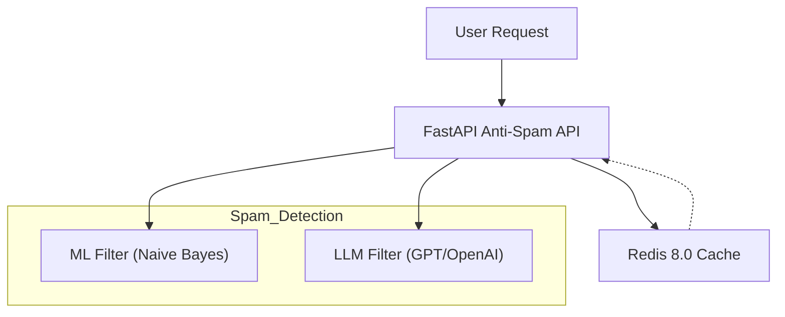

# Anti-Spam API with ML, DL & LLM

This project provides a FastAPI REST API to detect spam using:

- ML model (Naive Bayes like logic)
- LLM-based heuristic (OpenAI GPT or HuggingFace)
- Redis 8.0 caching and rate limiting support

## Architecture
See the `docs/project_structure.png` for the project structure diagram.
See the `docs/user_flow.png` for the user flow diagram.



## Run Locally

```bash
pip install -r requirements.txt
uvicorn api.main:app --reload
```

## Docker

```bash
docker build -t anti-spam-api .
docker run -p 8000:8000 anti-spam-api
```

## Kubernetes (k8s) Deployment with Helm

```bash
helm install anti-spam-api ./charts/anti-spam-api --set env.OPENAI_API_KEY="your-openai-api-key"
```

## Environment Variables

- `OPENAI_API_KEY` - OpenAI API key for LLM spam detection (optional)

## License

MIT
